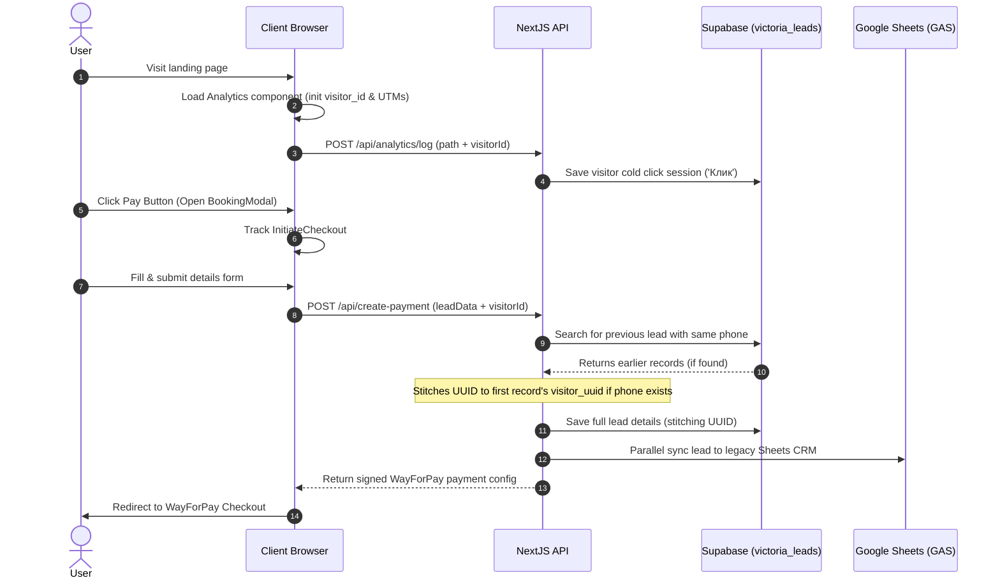

# Victoria Architecture Guide

This live document outlines the architecture, routing structure, components, database schemas, and integration details for the **Victoria** application.

> [!TIP]
> For a detailed, 1-to-1 blueprint of the leads capture, tracking analytics, and CRM stitching integrations designed for developers to clone on other projects, see the dedicated [CRM Architecture Guide](file:///c:/Users/yura3/Documents/Repositories/B&W%20Prod/EXPERTS/VICTORIA/victoria-mc/CRM_ARCHITECTURE.md).

---

## 🚀 Stack & Core Systems
*   **Frontend Framework:** Next.js (App Router, TS, React 19)
*   **Styling & UI:** CSS Modules, TailwindCSS, Framer Motion
*   **Database:** Supabase (PostgreSQL)
*   **Payment Gateway:** WayForPay
*   **CRM & Legacy Sync:** Google Sheets (Removed to maximize checkout redirect speed, all data now managed in Supabase)
*   **Notifications:** Telegram Bot API
*   **Marketing Automation:** SendPulse Chatbot API (for subscriber funnel tracking)

---

## 📂 File Map & Routing Structure

### 🛣️ App Router Routes (`src/app/`)
*   `layout.tsx` — Root layout initialized with global styles, fonts, and the visitor analytics logger.
*   `page.tsx` — Core landing page. Now supports dynamic headline testing via `?offer=1/2/3`, `?v=1/2/3`, or `utm_content` values, defaulting to Variant 1 (completely removing the old "ВІД ХАОСУ ДО СИСТЕМИ" version). Stitches selection into lead analytics.
*   `price/` — Price selection and package landing page.
*   `price/thanks/` — Thanks/success confirmation page after checkout.
*   `price/fail/` — Payment failure handling page.
*   `practicum/` — Dedicated masterclass practicum page.
*   `practicum/thanks/` — Thanks/success page for the practicum.
*   `practicum/fail/` — Failure page for the practicum.
*   `free-lection/` — VSL funnel start landing page. Supports `?uavslab=160626` query parameter for A/B testing redirect to an alternative Telegram chatbot chain.
*   `free-lection/vsl-form/` — VSL Step 2 form questionnaire.
*   `rozbir/` — Personal video breakdown offer page.
*   `anketa/` — Pre-registration Questionnaire Landing Page for lead capturing. Supports `?v=2` query parameter for A/B testing a different bonus structure (Consultation, Maximum Discount, Warming-up Structure) instead of the default layout. Form requires checking "Я очікую на дзвінок від команди" to submit.
*   `intensive/5-likes/` — [NEW] 4-Lesson Intensive landing page ("5 Лайків") with dark luxury aesthetic, 10-min countdown timer, 125€ bonus package (4 bonuses), "Це про тебе якщо", "Кому не підійде", "Що зміниться", Expert profile, 4-lesson curriculum breakdown, before/after cases & reviews lightbox, format & curation, why price explanation, 100% money-back guarantee, FAQ accordions, and resilient 9€ (EUR) WayForPay checkout integration.
*   `checkout/` — Dynamic checkout client page.
*   `admin/` — CRM Dashboard area with Role-Based Access Control (RBAC).

### 🌐 API Endpoints (`src/app/api/`)
*   `api/lead/` — Primary leads registration proxy. Submits leads in parallel to Telegram and BaseCRM (for VSL & Anketa funnels), and registers the customer inside Supabase (`victoria_leads`) with visitor stitching (Google Sheets sync removed for performance). BaseCRM payload `comment` field is dynamically constructed to include all questionnaire answers, explicit UTM parameters (`Source`, `Medium`, `Campaign`, `Content`, `Term`), and prior product/funnel visit history (`Бул(а) на інших продуктах/воронках: Так` with timestamps in Kiev time) if the user previously interacted with other funnels. Now omits individual Telegram notifications for VSL Stage 1 leads. Supports questionnaire fields (purpose, difficulties, readiness) from the pre-registration landing. Triggers SendPulse status `'3. Заповнив анкету'` if `sp_contact_id` is supplied.
*   `api/create-payment/` — Initiate checkout route. Starts Telegram payment alerts and persists the lead details into Supabase (`victoria_leads`). Returns signed WayForPay configuration.
*   `api/payment-callback/` — [NEW] Webhook target invoked by WayForPay to confirm transaction status. Syncs status updates back to Supabase (`victoria_leads`).
*   `api/leads/` — Secondary CRM status synchronization proxy. Updates Telegram messages and updates database status when users reach thanks/fail landing pages or manually update states.
*   `api/analytics/log/` — Traffic tracking telemetry receiver. Logs page views (`Клик`) and form modal actions directly in Supabase (`victoria_leads`). Triggers SendPulse status `'1. Зайшов на сайт'` for VSL funnel if `sp_contact_id` is supplied.
*   `api/video-progress/` — [NEW] Video watching progress tracking receiver. Logs played status, watch seconds, and updates lead status to `'полностью посмотрел'` once 20 minutes are reached. Triggers SendPulse status `'2. Подивився відео'` once the watch progress threshold (15 minutes) is met. Omits real-time Telegram alerts to prevent channel spam.
*   `api/country/` — [NEW] Vercel Edge API endpoint that extracts `x-vercel-ip-country` from incoming CDN headers to resolve user country instantly on mount.
*   `api/cron/sync-payments/` — [NEW] WayForPay payment reconciliation cron endpoint. Performs bidirectional 3-day (or customizable `?days=N` / `?start=...&end=...`) transaction synchronization with WayForPay API (`TRANSACTION_LIST`), idempotently reconciles lead statuses (`Approved`, `Declined`, `Expired`), and inserts missing direct/invoice purchases without duplication.
*   `api/cron/vsl-report/` — Analytical cron route.
    *   **Daily:** Runs at 9:00 AM Kyiv time (`0 6 * * *` UTC) with 24-hour period.
    *   **Weekly:** Runs on Mondays at 10:00 AM Kyiv time (`0 7 * * 1` UTC) when `?type=weekly` is specified, reporting over a 7-day period.
    *   **Pre-Report Auto-Sync:** Executes `syncWayForPayTransactions({ daysBack: 3 })` directly before lead extraction to guarantee 100% accurate financial reconciliation.
    *   Aggregates all funnels (VSL, Practicum, Pre-registration Anketa, Video Breakdown, Booking, Autoweb) and traffic/clicks metrics across all landing sites, performs conversion cohort matching, determines the best UTM source per funnel, and sends a comprehensive summary report to Telegram. Includes detailed VSL cohort analysis (site visits, watch button clicks, completed views, average watch duration, and questionnaire fill-out moment distributions).

### 🧩 UI Components & Data (`src/components/`, `src/data/`)
*   `src/data/cases.ts` — Centralized real student cases (Ksenia, Anastasia) with before/after visual metrics and reviews registry.
*   `CASES_REGISTRY.md` — Central documentation registry of client cases, copy, and media assets.
*   `Form.tsx` — Core registration form component.
*   `Analytics.tsx` — Client-side React tracking component. Generates a secure `visitor_id`, extracts UTM parameters, and logs telemetric sessions on load.
*   `pricing/BookingModal.tsx` — Premium checkout modal. Triggers payment generation and redirects user to WayForPay. Uses `react-phone-number-input` for exact international numbers with Edge CDN geo-detection.
*   `practicum/PracticumHeroForm.tsx` — Practicum subscription form.
*   `blocks/BlockCases.tsx` — Before-and-after student visual cases grid connected to `REAL_CASES`.
*   `blocks/BlockReviews.tsx` — Student reviews grid with interactive lightbox connected to `REVIEWS_GALLERY`.
*   `blocks/BlockBonusTimer.tsx` — Active bonuses showcase with persistent 10-minute countdown timer.
*   `blocks/BlockGuarantee.tsx` — Dynamic pricing details copy, money-back guarantee, and doubts resolution.
*   `intensive/IntensiveCasesReviews.tsx` — High-converting Before/After cases and reviews section for 5-Likes Intensive.
*   `intensive/IntensiveCheckoutModal.tsx` — [NEW] Dedicated 9€ EUR checkout modal with instant validation and WayForPay integration.
*   `intensive/use10MinTimer.ts` — [NEW] Synchronized persistent 10-minute countdown timer hook.

### 🧪 QA Regression Tests (`tests/`)
*   `tests/test_all_landings.js` — Universal E2E test script simulating page views and form submissions across all 6 landing pages.
*   `tests/check_supabase.js` — DB validation script using `@supabase/supabase-js` to inspect and assert QA test lead records in Supabase.

---

## 🗄️ Database Schema & Supabase (`victoria_leads`)

Table name: `victoria_leads`

| Field | Type | Default | Description |
| :--- | :--- | :--- | :--- |
| `id` | `uuid` | `gen_random_uuid()` | Unique lead row identifier (Primary Key) |
| `created_at` | `timestamptz` | `now()` | Date and time of insertion |
| `name` | `text` | `NULL` | Customer full name |
| `phone` | `text` | `NULL` | Normalized phone number or Telegram nick |
| `social` | `text` | `NULL` | Telegram social handle/nickname |
| `instagram` | `text` | `NULL` | Instagram nickname / handle |
| `niche` | `text` | `NULL` | Chosen professional niche/topic |
| `amount` | `numeric` | `0` | Paid or pending order amount |
| `status` | `text` | `'Зареєстровано'` | Lead status (`Клик`, `КликФормы`, `Зареєстровано`, `Approved`) |
| `is_free` | `boolean` | `true` | Free or paid trial flag |
| `order_id` | `text` | `NULL` | WayForPay unique order reference |
| `sheet_id` | `text` | `NULL` | Associated Google Sheet ID |
| `target_sheet` | `text` | `NULL` | Target sheet name in CRM |
| `utm_source` | `text` | `NULL` | UTM Campaign Source |
| `utm_medium` | `text` | `NULL` | UTM Campaign Medium |
| `utm_campaign`| `text` | `NULL` | UTM Campaign Name |
| `utm_content` | `text` | `NULL` | UTM Campaign Content |
| `utm_term` | `text` | `NULL` | UTM Campaign Term |
| `page_path` | `text` | `NULL` | Current path string (e.g. `'/price'`) |
| `page_url` | `text` | `NULL` | Full page absolute URL |
| `visitor_uuid`| `uuid` | `NULL` | Persistent device identifier for stitching |
| `raw_payload` | `jsonb` | `NULL` | Original parsed request body |
| `tg_msg_id`   | `text`  | `NULL` | Telegram bot notification message identifier for editing |

### 🔗 B&W Analytics Sync (Единая сквозная аналитика)
Вся таблица `victoria_leads` находится под постоянным наблюдением авто-триггера **`trg_sync_victoria_lead`** на стороне Supabase. 
При любой вставке (INSERT) в `victoria_leads` данные автоматически обрабатываются триггером на уровне БД и реплицируются в централизованные таблицы сквозной аналитики под идентификатором проекта Victoria (`b526cfcf-2856-43b9-a299-65239e0f6c27`):
*   **`unified_customers`** — таблица уникальных профилей. Триггер проверяет уникальность телефона/email/telegram строго внутри проекта Victoria, дедуплицируя контакты и предотвращая перезапись данных других экспертов холдинга.
*   **`unified_orders`** — таблица лид-событий/заказов. Каждое действие, заявка или оплата регистрируется в виде **новой строки** со своими UTM-метками, суммами и рекламными ID (`campaign_id`, `ad_id`), сохраняя полную когортную историю и точный расчет LTV.
*   **Бесшовность:** Исключает необходимость доработки или изменения серверного API-кода самого приложения Victoria.

---

## 📈 Analytics & Lead Stitching Workflow

---

## ✉️ SendPulse Chatbot Integration Workflow

The VSL funnel tracks user interactions and updates contact variables in SendPulse in real time:

1. **Link Parameter**: The Telegram Bot button should direct the user to the landing page with the parameter `?sp_contact_id={{contact_id}}`.
2. **Client-side Capture**: The [Analytics.tsx](file:///c:/B&W%20Prod/B&W%20Prod/victoria-mc/src/components/Analytics.tsx) component parses this parameter and stores it in `localStorage`.
3. **Funnel Status Mapping**:
   * **State 1: `1. Зайшов на сайт`** — Set when the user lands on the page (handled via `/api/analytics/log`).
   * **State 2: `2. Подивився відео`** — Set when the video progress reaches 15 minutes or more, or is marked as `'полностью посмотрел'` (handled via `/api/video-progress`).
   * **State 3: `3. Заповнив анкету`** — Set when the user submits the questionnaire form (handled via `/api/lead`).
4. **State Persistence**: The contact ID is stored in the lead's `raw_payload` as `sp_contact_id` along with `vsl_sendpulse_stage` (1, 2, or 3) to prevent duplicate API requests.
5. **SendPulse API Helper**: The backend calls [sendpulse.ts](file:///c:/B&W%20Prod/B&W%20Prod/victoria-mc/src/lib/sendpulse.ts) to handle OAuth token caching and set the `vsl_status` variable.
